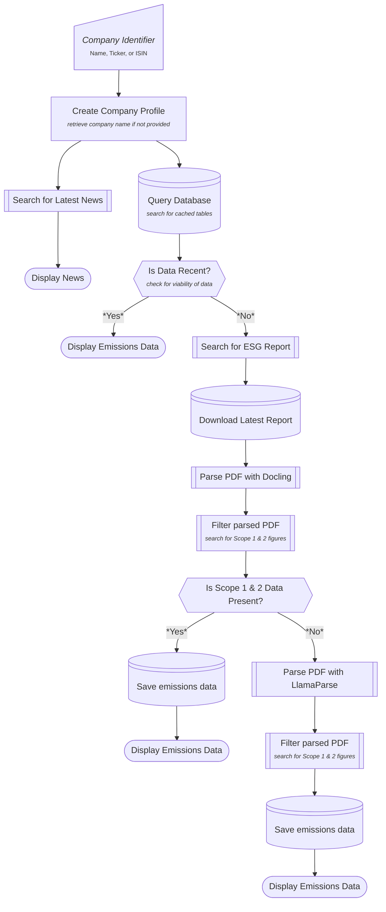

```mermaid
flowchart TD

    A@{ shape: sl-rect, label: "*Company Identifier* <br> <sub><sup>Name, Ticker, or ISIN </sub></sup>"}
    A --> B@{ shape: rect, label: "Create Company Profile <br> <sub><sup> *retrieve company name if not provided* </sub></sup>"}
    B --> BB@{ shape: fr-rect, label: "Search for Latest News"}
    BB --> BB1@{ shape: stadium, label: "Display News"}
    B --> C@{ shape: lin-cyl, label: "Query Database <br> <sub><sup> *search for cached tables* </sub></sup>"}
    C --> D@{ shape: hexagon, label: "Is Data Recent? <br> <sub><sup> *check for viability of data* </sub></sup>"}
    D -->|*Yes*| E@{ shape: stadium, label: "Display Emissions Data"}
    D -->|*No*| F@{ shape: fr-rect, label: "Search for ESG Report"}
    F --> G@{ shape: lin-cyl, label: "Download Latest Report"}
    G --> H@{ shape: fr-rect, label: "Parse PDF with Docling"}
    H --> I@{ shape: fr-rect, label: "Filter parsed PDF <br> <sub><sup> *search for Scope 1 & 2 figures* </sub></sup>"}
    I --> II@{ shape: hexagon, label: "Is Scope 1 & 2 Data Present?"}
    II --> |*Yes*| J@{ shape: lin-cyl, label: "Save emissions data"}
    II --> |*No*| JJ@{ shape: fr-rect, label: "Parse PDF with LlamaParse"}
    J --> K@{ shape: stadium, label: "Display Emissions Data"}
    JJ --> L@{ shape: fr-rect, label: "Filter parsed PDF <br> <sub><sup> *search for Scope 1 & 2 figures* </sub></sup>"}
    L --> M@{ shape: lin-cyl, label: "Save emissions data"}
    M --> N@{ shape: stadium, label: "Display Emissions Data"}
```